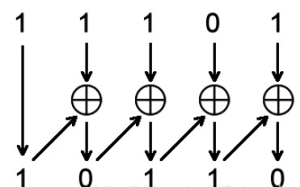

# 异步FIFO

### 格雷码

**1. 二进制转格雷码**    

从二进制码的最右边一位（最低位）起，依次将每一位与左边一位进行异或运算，作为对应格雷码该位的值，而最左边高位不变。


```verilog
g[n] = b[n]，
g[i] = b[i] xor b[i+1] (i∈N,n-1≥i≥0)；
```

Verilog描述：    

```verilog
assign gray_value = binary_value ^ (binary >> 1);
```

**2. 格雷码转二进制码**     

从格雷码左边第二位（次高位）起，将每一位与其左边一位解码后的值异或，作为该位解码后的值，而最左边一位（最高位）不变就是它本身。



```verilog
b[n] = g[n]，
b[i] = g[i] xor b[i+1] (i∈N, n-1≥i≥0)
```

Verilog描述：  

```verilog
assign bin[N-1] = gray[N-1]; //据格雷码的最高位，得到二进制的最高位
genvar i;
generate
    for(i = N-2; i >= 0; i = i - 1) begin: gray_2_bin
        assign bin[i] = bin[i + 1] ^ gray[i];  //二进制码的最高位与格雷码的次高位相异或，得到二进制的次高位
    end
endgenerate
```


或者描述为：

```verilog
integer i
always @ (gray)
    for (i = 0; i <= SIZE; i = i + 1)
        bin[i] = ^(gray >> i);
```


