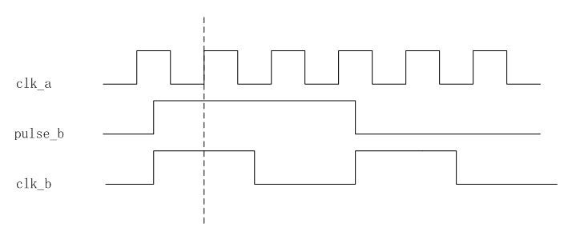
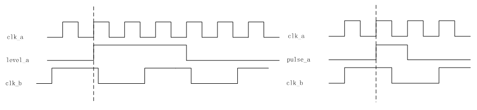

# 题目：多时钟域设计中，如何处理跨时钟域

* 单bit：两级触发器同步（适用于慢到快）
* 多bit：采用异步FIFO，异步双口RAM
* 加握手信号
* 格雷码转换

参考资料：[FPGA&ASIC笔面试题船新版本](../doc/FPGA&amp;ASIC笔面试题船新版本.pdf) [跨时钟域处理方法](https://www.cnblogs.com/rouwawa/p/7501319.html)  

**信号从B到A（慢到快）**



```verilog
always@(posedge clk_a or negedge rst_n)
    begin
        if(rst_n == 1'b0)
            begin
                pules_a_r1 <= 1'b0;
                pules_a_r2 <= 1'b0;
                pules_a_r3 <= 1'b0;
            end
        else
            begin
                pules_a_r1 <= pules_b;
                pules_a_r2 <= pules_a_r1;
                pules_a_r3 <= pules_a_r2;
            end
    end

assign pulse_a_pos = pules_a_r2 & (~pules_a_r3);
assign pulse_a_neg = pules_a_r3 & (~pules_a_r2);
assign pulse_a     = pules_a_r2;
```

**信号从A到B（快到慢）**



先把脉冲信号在clk_a下展宽，变成电平信号signal_a，再向clk_b传递，当确认clk_b已经“看见”信号同步过去之后，再清掉signal_a。代码通用框架如下：

```verilog
module Sync_Pulse (
    input  clk_a,
    input  clk_b,
    input  rst_n,
    input  pulse_a,
    output pulse_b_out,
    output b_out
);
    reg signal_a;
    reg signal_b;
    reg signal_b_r1;
    reg signal_b_r2;
    reg signal_b_a1;
    reg signal_b_a2;
    
    // 在时钟域clk_a下，生成展宽信号signal_a
    always @(posedge clk_a or negedge rst_n)
        begin
            if(rst_n == 1'b0)
                signal_a <= 1'b0;
            else if(pulse_a_in)
                signal_a <= 1'b1;
            else if(pulse_b_a2)
                signal_a <= 1'b0;
        end
    
    // 在时钟域clk_b下，采集signal_a，生成signal_b
    always @(posedge clk_b or negedge rst_n)
        begin
            if(rst_n == 1'b0)
                signal_b <= 1'b0;
            else
                signal_b <= signal_a;
        end
    
    // 多级触发器处理
    always @(posedge clk_b or negedge rst_n)
        begin
            if(rst_n == 1'b0)
                begin
                    signal_b_r1 <= 1'b0;
                    signal_b_r2 <= 1'b0;
                end
            else
                begin
                    signal_b_r1 <= signal_b;
                    signal_b_r2 <= signal_b_r1;
                end
        end
    
    // 在时钟域clk_a下，采集signal_b_r1，用于反馈来拉低展宽信号signal_a
    always @(posedge clk_a or negedge rst_n)
        begin
            if(rst_n == 1'b0)
                begin
                    signal_b_a1 <= 1'b0;
                    signal_b_a2 <= 1'b0;
                end
            else
                begin
                    signal_b_a1 <= signal_b_r1;
                    signal_b_a2 <= signal_b_a1;
                end
        end
    
    assign pulse_b_out = signal_b_r1 & (~signal_b_r2);
    assign b_out       = signal_b_r1;
    
endmodule
```

