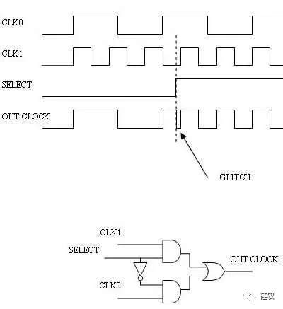
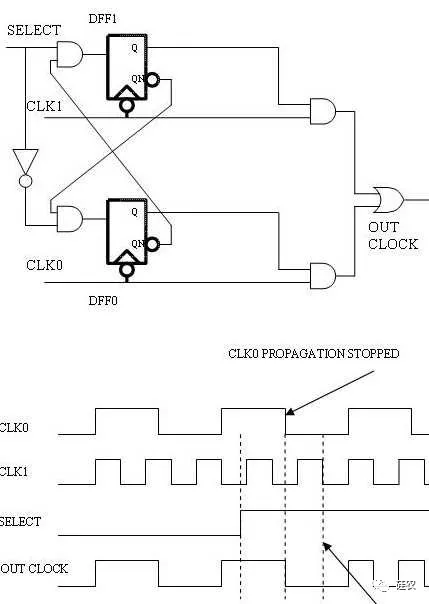
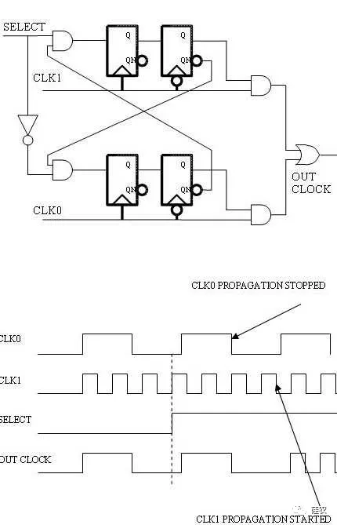

### 题目：用Verilog实现glitch free 时钟切换电路

**输入select, clka, clkb. select为1输出clka, select为0输出clkb**

理论知识：  
[Glitch Free时钟切换技术](https://mp.weixin.qq.com/s/w3Wu7HkSr5v94kHrLvRIcw)  
[Glitch Free时钟切换技术另一篇博客](https://blog.csdn.net/Reborn_Lee/article/details/90378355?tdsourcetag=s_pctim_aiomsg)

part1是比较辣鸡的写法

part2是两个时钟源为异步时钟的关系

part3是两个时钟源为异步时钟的关系

**有毛刺的时钟切换电路**



```verilog
// --------------------------
// Part 1
// 很辣鸡的写法
// --------------------------
module change_clk_source (
    input  clk1,
    input  clk0,
    input  select,
    input  rst_n,
    output outclk
);

assign outclk = (clk1 & select) | (~select & clk0);

endmodule
```

**相关时钟源的毛刺保护**



```verilog
// --------------------------
// Part 2
// 两个时钟源是倍数的关系
// --------------------------
module change_clk_source (
    input  clk1,
    input  clk0,
    input  select,
    input  rst_n,
    output outclk
);

reg out1;
reg out0;

always @(negedge clk1 or negedge rst_n)
begin
    if(rst_n == 1'b0)
        begin
            out1 <= 0;
        end
    else
        begin
            out1 <= ~out0 & select;
        end
end

always @(negedge clk0 or negedge rst_n)
begin
    if(rst_n == 1'b0)
        begin
            out0 <= 0;
        end
    else
        begin
            out0 <= ~select & ~out1;
        end
end

assign outclk = (out1 & clk1) | (out0 & clk0)

endmodule
```

**针对无关时钟源的毛刺保护**



```verilog
// --------------------------
// Part 3
// 两个时钟源为异步时钟的关系
// --------------------------
module change_clk_source (
    input  clk1,
    input  clk0,
    input  select,
    input  rst_n,
    output outclk
);

reg out_r1;
reg out1;
reg out_r0;
reg out0;

always @(posedge clk1 or negedge rst_n)
begin
    if(rst_n == 1'b0)
        begin
            out_r1 <= 0;
        end
    else
        begin
            out_r1 <= ~out0 & select;
        end
end

always @(negedge clk1 or negedge rst_n)
begin
    if(rst_n == 1'b0)
        begin
            out1 <= 0;
        end
    else
        begin
            out1 <= out_r1;
        end
end

always @(posedge clk0 or negedge rst_n)
begin
    if(rst_n == 1'b0)
        begin
            out_r0 <= 0;
        end
    else
        begin
            out_r0 <= ~select & ~out1;
        end
end

always @(negedge clk0 or negedge rst_n)
begin
    if(rst_n == 1'b0)
        begin
            out0 <= 0
        end
    else
        begin
            out0 <= out_r0;
        end
end

assign outclk = (out1 & clk1) | (out0 & clk0);

endmodule
```
