## 跨时钟问题(Clock Domain Crossing)

### 亚稳态

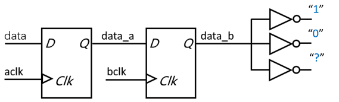

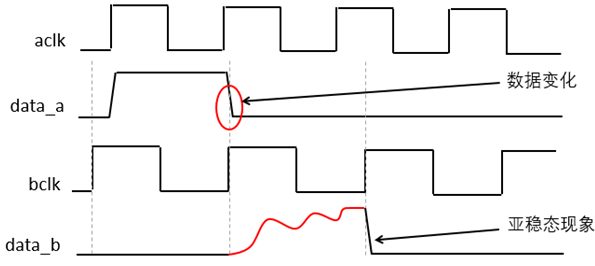

产生原因：

​	跨时钟域数据不满足目标时钟的建立保持时间

解决方案：

​	两级或多级同步器隔离亚稳态

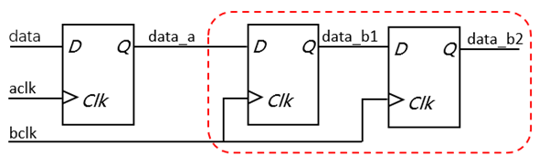

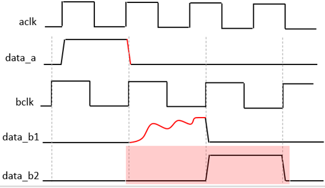

* 亚稳态无法消除
* 亚稳态只能被隔离，降低发生概率
* 两级同步器之间不要有组合逻辑

如何评估其危害——MTBF

MTBF：故障前的平均时间

* MTBF定量评估亚稳态对可靠性的影响
* MTBF is a measure of how often, on the average, a metastable event lasts a time tr or  longer.

下式适用于一级同步寄存

$$
MTBF=\frac{e^{t_r/t_{sw}}}{Wf_cf_d}
$$

* tr——the resolving time allowed for metastable events
* tsw——device specific
* W——device specific
* fc——system clock frequency
* fd——average asynchronous data frequency

$$
MTBF=\frac{e^{t_r/\tau}}{T_0f\alpha}
$$

$$
MTBF=\frac{1}{f_{clk} * f_{data} * x}
$$

随着同步时钟频率和数据变化频率的提升，MTBF的值越小，电路出现亚稳态的概率就越高。

### 数据保持（快时钟域到慢时钟域）

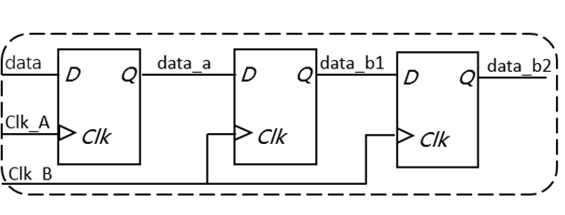

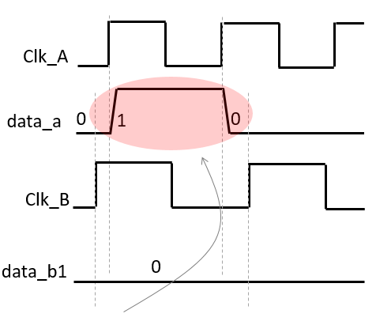

产生原因：

​	数据从快时钟域到慢时钟域，数据保持的时间较短，无法被慢时钟域采样

解决方案

* 数据展宽
* 脉冲同步器

数据展宽

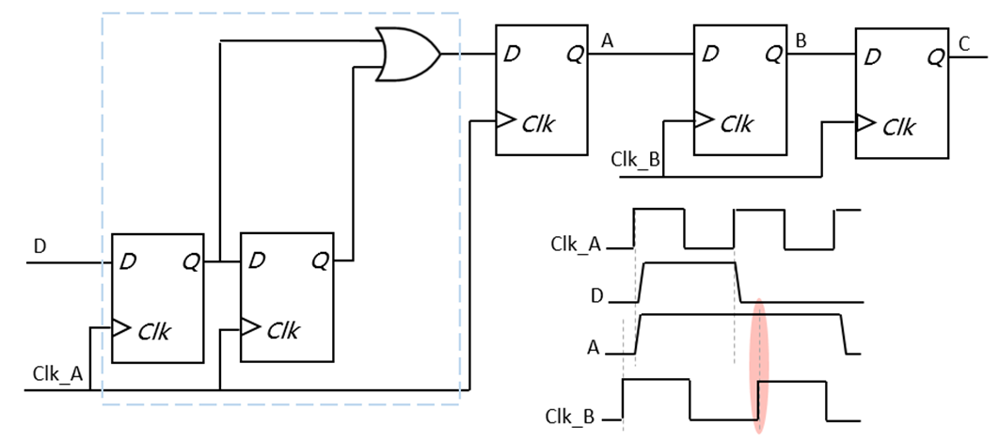

脉冲同步器（也适用于低频时钟域到高频时钟域）

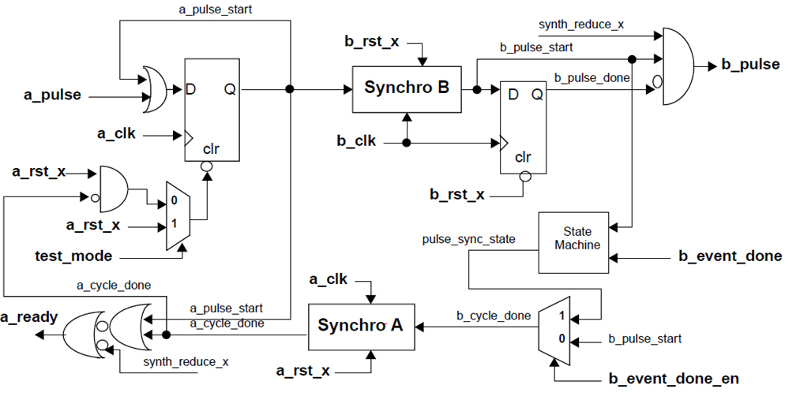

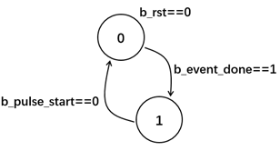

1. 时钟域A中采样a_pulse后保持
2. 电平信号送到时钟域B中同步并生成脉冲信号b_pulse
3. 在时钟域A中生成的电平信号需要复位，在时钟域B中生成的复位信号，b_cycle_done产生
4. b_cycle_done送到时钟域A中同步，产生复位信号

特点：

* 异步复位
* 响应信号，具有握手机制
* 测试模式信号

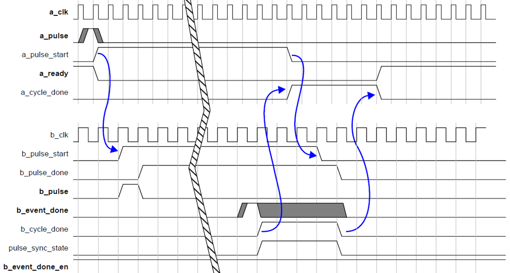

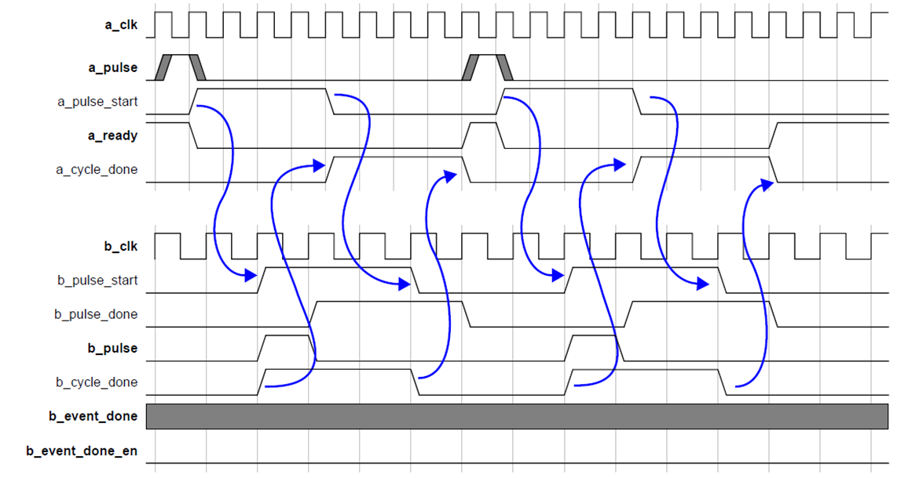

### 数据冗余（慢时钟域到快时钟域）

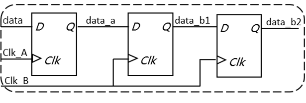

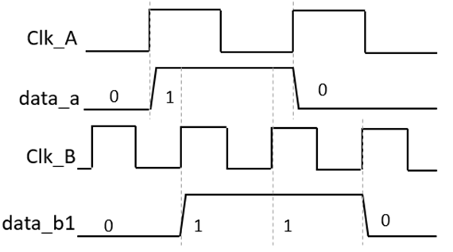

产生原因：

​	数据从慢时钟域到快时钟域，数据在目标时钟域被多次采样

解决方案：

* 脉冲同步器
* 边沿检测

边沿检测

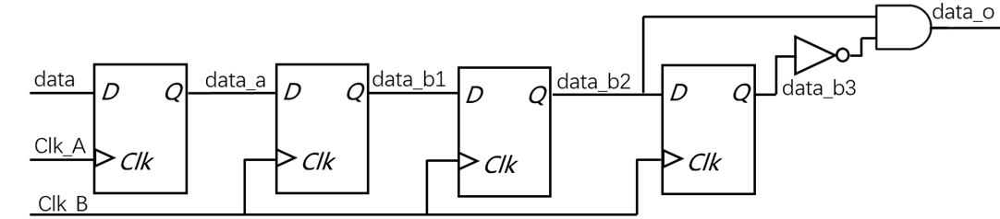

### 数据相关性丢失

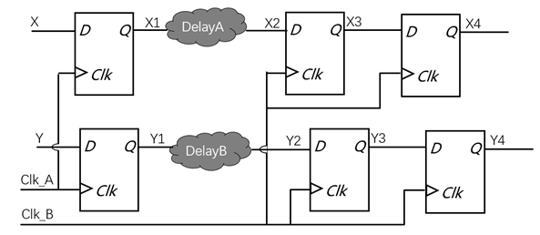

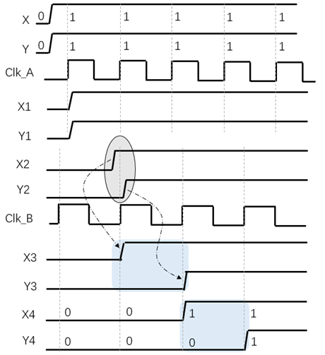

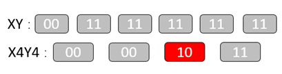

产生原因

​	延迟与时钟不确定性令目标时钟域采样无效数据

解决方案

* 格雷码编码
* 握手机制
* 异步FIFO
* 门控机制

多位控制信号解决方案

数据相关，按顺序依次变化，地址指针或状态机的状态矢量

解决方案：

格雷码编码

相邻数据间转换时，只有一位产生变化，地址范或状态数量为2^n个

二进制编码

| **D0** | **0** | **0** | **0** | **0** | **1** | **1** | **1** | **1** |
| ------ | ----- | ----- | ----- | ----- | ----- | ----- | ----- | ----- |
| **D1** | **0** | **0** | **1** | **1** | **0** | **0** | **1** | **1** |
| **D2** | **0** | **1** | **0** | **1** | **0** | **1** | **0** | **1** |

格雷码编码

| **D0** | **0** | **0** | **0** | **0** | **1** | **1** | **1** | **1** |
| ------ | ----- | ----- | ----- | ----- | ----- | ----- | ----- | ----- |
| **D1** | **0** | **0** | **1** | **1** | **1** | **1** | **0** | **0** |
| **D2** | **0** | **1** | **1** | **0** | **0** | **1** | **1** | **0** |

数据信号解决方案

* 异步FIFO
* 握手协议
* 使能信号控制

异步FIFO

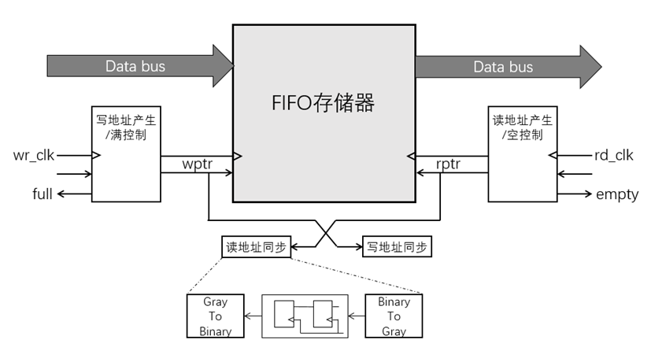

* 读写指针用格雷码编码后同步
* “空信号”在读时钟域产生
* “满信号”在写时钟域产生

握手协议

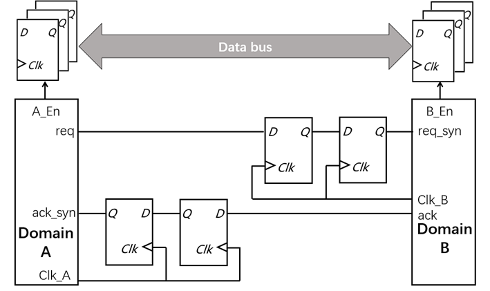

* 'req'信号同步至Clk_B
* 'ack'信号同步至Clk_A
* 数据保持直到握手完成

使能信号控制

### 复位信号的同步

* 同步时序电路保证
* 复位电平的时长

### 无毛刺时钟切换（Glitch Free Clock MUX）

1. 会产生毛刺的时钟切换

   

   

2. 无毛刺的时钟切换

   

   

详细参考这篇博客：[Glitch Free时钟切换技术](https://mp.weixin.qq.com/s/w3Wu7HkSr5v94kHrLvRIcw)

### 同步错误示例

1. 存在信号未同步

   

2. 两个或多个时钟源的数据在同步之前相遇

   

   