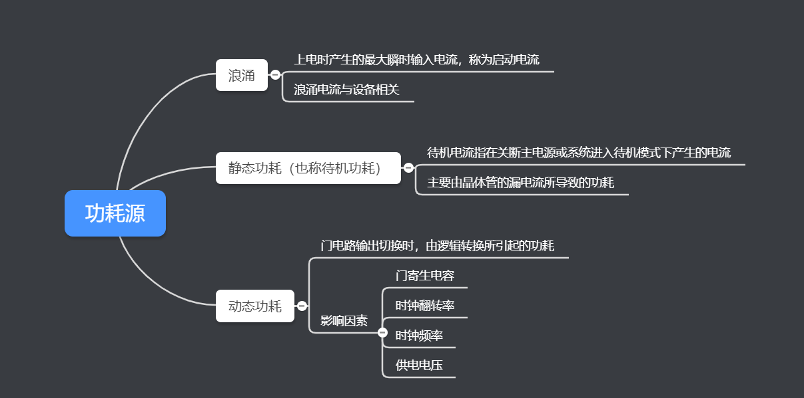
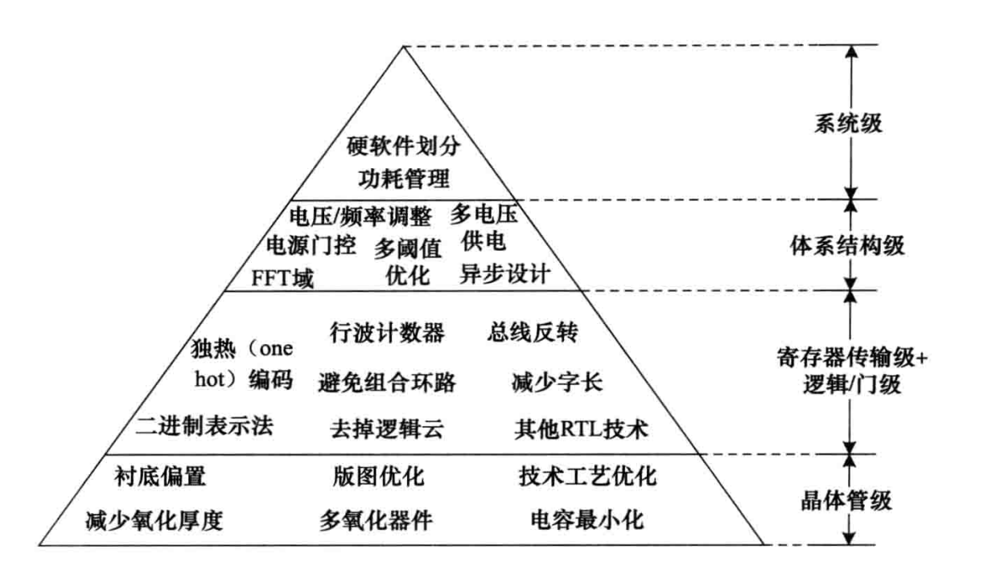

# 低功耗

浪涌、静态功耗和动态功耗是三个主要的功耗源。

### 低功耗技术

**层次越高对功耗降低越有效**

**1.系统级低功耗技术**

* 片上系统方法  
* 硬件/软件划分
* 使用低功耗软件
* 选择合适的处理器

**2.体系结构级降低功耗技术**

* 多电压设计技术(Multi-VDD)
* 高级门控时钟(Clock Gating)
* 动态电压频率调节(DVFS技术)
* 基于缓存的系统体系结构
* 对数FFT体系结构
* 异步(无时钟)技术
* 电源门控(Power Gating)
* 高阈值电压(HVT)
* 存储器电源门控

**3.寄存器传输级(RTL级)降低功耗**

* 并行与流水
* 状态机编码和解码
* 门控时钟
* 独热码多路器
* MUX选择的二进制编码
* 除掉多余的转换
* 资源共享
* 使用行波计数器来降低功耗
* 总线翻转编码技术
* 高活跃度网络
* 启用和禁用逻辑云

**4.物理级低功耗技术**

* 技术水平
* 版图优化
* 衬底偏压
* 减少氧化层厚度
* 多氧化层厚度
* 设计减小电容

