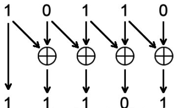
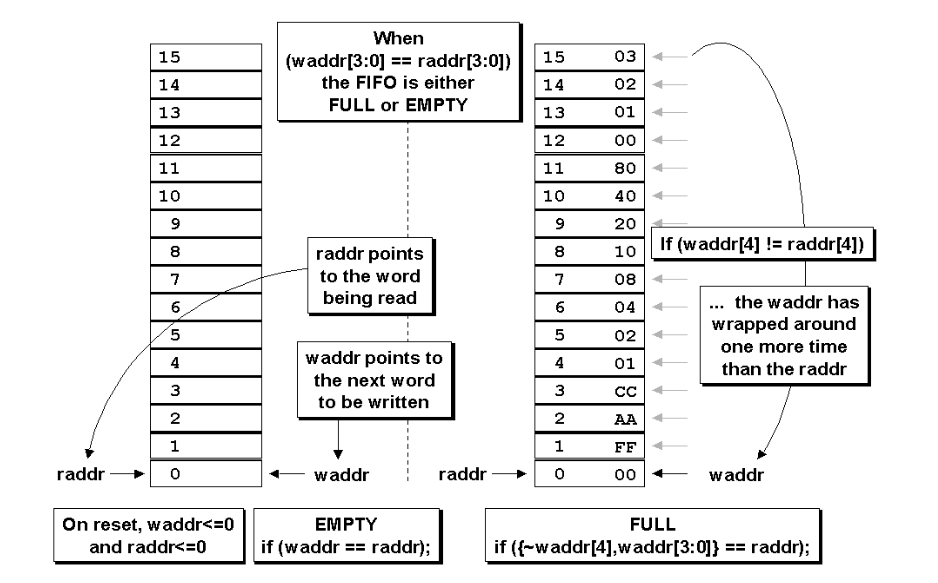
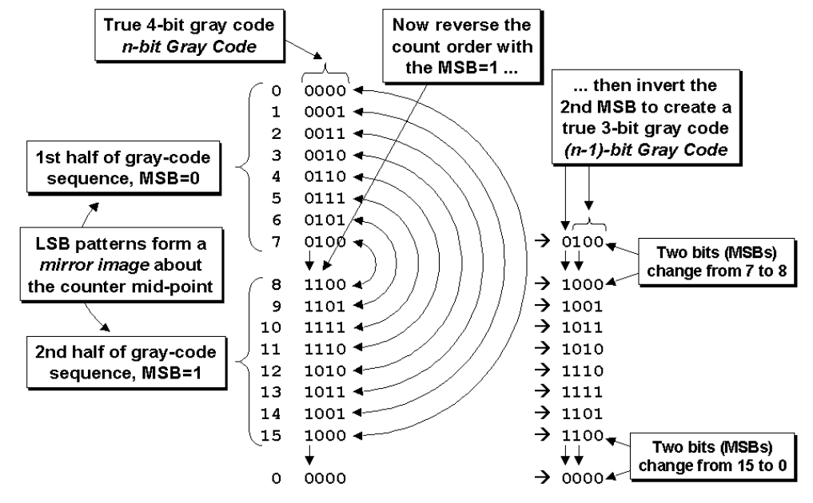

# 异步FIFO

### 格雷码

**1. 二进制转格雷码**    

从二进制码的最右边一位（最低位）起，依次将每一位与左边一位进行异或运算，作为对应格雷码该位的值，而最左边高位不变。



```verilog
g[n] = b[n]，
g[i] = b[i] xor b[i+1] (i∈N,n-1≥i≥0)；
```

Verilog描述：    

```verilog
assign gray_value = binary_value ^ (binary >> 1);
```

**2. 格雷码转二进制码**     

从格雷码左边第二位（次高位）起，将每一位与其左边一位解码后的值异或，作为该位解码后的值，而最左边一位（最高位）不变就是它本身。


```verilog
b[n] = g[n]，
b[i] = g[i] xor b[i+1] (i∈N, n-1≥i≥0)
```

Verilog描述：  

```verilog
assign bin[N-1] = gray[N-1]; //据格雷码的最高位，得到二进制的最高位
genvar i;
generate
    for(i = N-2; i >= 0; i = i - 1) begin: gray_2_bin
        assign bin[i] = bin[i + 1] ^ gray[i];  //二进制码的最高位与格雷码的次高位相异或，得到二进制的次高位
    end
endgenerate
```


或者描述为：

```verilog
integer i
always @ (gray)
    for (i = 0; i <= SIZE; i = i + 1)
        bin[i] = ^(gray >> i);
```

**格雷码计数器**  


```verilog
module gray_counter(clk, gray, inr, reset_n)
    parameter SIZE = 4;
    input clk, inr, reset_n;
    output [SIZE-1] gray;
    reg [SIZE-1] gray_temp, gray, bin_temp, bin;
    integer i;
    
    always @ (gray or inr)
        begin: gray_bin_gray
            for (i = 0; i < SIZE; i = i + 1)
                bin[i] = ^(gray >> i);
            bin_temp = bin + inr;
            gray_temp = (bin_temp >> 1) ^ bin_temp;
        end
endmodule
```

### 异步FIFO

异步FIFO原理如下图所示：


异步FIFO空满标志的判定：

为了区分空满标志，读写指针增加1bit。



**FIFO空条件的产生**

当读指针与同步后的写指针相匹配时，FIFO为空，这时应该在FIFO的读时钟域内马上产生FIFO空标记。

```verilog
always @ (posedge rclk or negedge reset_n)
    begin: fifo_empty_gen
        if(~reset_n)
            fifo_empty <= 1'b1;
        else
            fifo_empty <= (rd_gtemp == wr_ptr_sync);
    end
```

**FIFO满条件的产生**  

满的条件为`{~waddr[4], waddr[3:0] == raddr}`



根据格雷码的特点，在以下三个条件都为真时，FIFO满标志置起。

1. 同步后的读指针(rd_ptr_sync)的MSB应该与写指针(wr_gtemp)的下一个格雷码值的MSB不同。
2. 写时钟域中下一个格雷码计数值对应二进制码的第二个MSB(wr_gtemp)，应该与同步到写时钟域内读指针的MSB相同(rd_ptr_sync)。
3. 两个指针中所有省略掉的LSB都应该匹配。

*注意*

上面第2点中的第二个MSB通过将指针前两个MSB异或后计算出来。（如果MSB为高，对两个MSB进行异或操作会使第二个MSB取反。）

```verilog
wire rd_2nd_msb = rd_ptr_sync[SIZE] ^ rd_ptr_sync[SIZE-1];
wire wr_2nd_msb = wr_gtemp[SIZE] ^ wr_gtem[SIZE-1];
always @ (posedge wclk or negedge reset_n)
    begin: fifo_full_gen
        if(~reset_n)
            fifo_full <= 1'b0;
        else
            fifo_full <= ((wr_gtemp[SIZE] != rd_ptr_sync[SIZE]) &&
                          (rd_2nd_msb == wr_2nd_msb) &&
                          (wr_gtemp[SIZE-2:0] == rd_ptr_sync[SIZE-2:0]));
    end
```

### 附录

一个四位十六个状态的格雷码计数器，起始值为1001，经过100个时钟脉冲作用之后的值为（）。

**解析：** 先计算出100个脉冲后跑了多少个16状态，100/16=6余4；故需要知道1001后的第四个状态是哪个？1001转为二进制为1110，1110为十进制14，再后4个数是15，0,1，2；故第四个数为2，转为格雷码为：**0011**

[异步FIFO的Verilog代码实现](../code/async_fifo_verilog.md)
