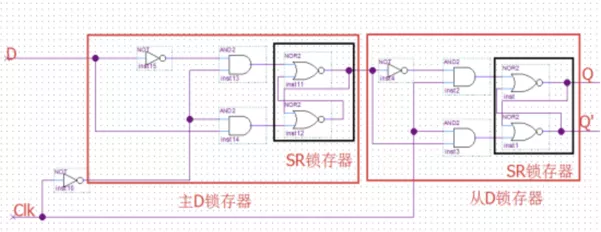
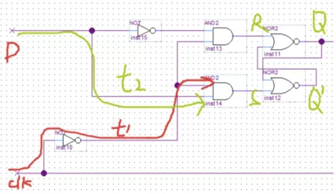

<h1>
时序约束整理
</h1>

##  时序分析基础知识

**什么是时序分析**

时序分析本质上就是一种时序检查，目的是检查设计中所有的D触发器是否能够正常工作，也就是检查D触发器的同步端口（数据输入端口）的变化是否满足建立时间要求（Setup）和保持时间要求（Hold）；检查D触发器的异步端口（异步复位端口）的变化是否满足恢复时间要求（Recovery）和移除时间要求（Removal）。

**时序分析有哪些类型**

时序分析包括静态时序分析（STA）和动态时序分析。

* 动态时序分析：将布局布线生成的布线延迟信息反标注到门级网表中进行仿真，检查是否存在时序违例。此时的仿真包括门延迟和布线延迟信息，能够较好反应芯片的实际工作情况。因为不可能产生完备的测试向量，覆盖门级网表中的每一条路径。因此在动态时序分析中，无法暴露一些路径上可能存在的时序问题。
* 静态时序分析：采用穷尽分析方法来提取出整个电路存在的所有时序路径，计算信号在这些路径上的传播延时，检查信号的建立和保持时间是否满足时序要求，通过对最大路径延时和最小路径延时的分析，找出违背时序约束的错误。它不需要输入向量就能穷尽所有的路径，且运行速度很快、占用内存较少，不仅可以对芯片设计进行全面的时序功能检查，而且还可利用时序分析的结果来优化设计，因此静态时序分析已经越来越多地被用到数字集成电路设计的验证中。

**时序分析使用的工具有哪些**

* 静态时序分析使用的工具
  * Xilinx Vivado Intergrated Design Enviroment Time Engine
  * Altera Quartus || Timequest
  * DC等
* 动态时序分析使用的工具
  * Mentor Modelsim
  * Cadence NC-Verilog
  * Sysnopsys VCS

**静态时序分析之前的准备工作**

撰写基本的时序约束文件，告知时序引擎一些必要的信息（比如时钟，输入输出延时等）。若没有正确的时序约束，那么时序分析的结果是没有意义的。

**时序分析中的常用术语**

* 源时钟（Source Clock/Launch Clock，也称发起时钟）
* 目的时钟（Destination Clock/ Capture Clock, 也称捕获时钟）
* 发起沿（Launch Edge，源时钟产生数据的有效时钟沿）
* 捕获沿（Capture Edge，目的时钟捕获数据的有效时钟沿）

发起沿通常在0ns，捕获沿通常在下一个发起沿，发起沿和捕获沿通常相差一个时钟周期。

**一条普通时序路径的三要素**

* 源时钟路径：从源时钟的源节点（通常是FPGA的时钟输入引脚）到源寄存器的时钟端口的路径。当时序路径的起点是FPGA输入端口时，该时序路径是没有源时钟路径的。
* 数据路径：从时序路径的起点到时序路径的终点之间的数据传播路径。时序路径的起点可以是源寄存器的时钟端口或FPGA的输入端口，时序路径的终点可以是目的寄存器的输入端口或FPGA的输出端口。
* 目的时钟路径：从目的时钟的源节点（通常是FPGA的时钟输入引脚）到目的寄存器的时钟端口的路径。当时序路径的终点是FPGA的输出端口时，该时序路径是没有目的时钟路径的。

**FPGA中常见的四种时序路径**

1. 从FPGA的输入端口到目的寄存器的数据输入端口

   * 数据由Board Clock发起并在FPGA外部产生
   * 数据经过Input Delay的延迟后到达FPGA的输入端口
   * 数据经过FPGA的Internal Delay后到达由目的时钟驱动的目的寄存器

   这种路径是没有源时钟路径的，用户需要约束Input Delay和时钟来告知时序引擎必要信息，时序引擎才能正确的分析这种路径

2. 从源寄存器的时钟端口到目的寄存器的数据输入端口

   * 数据由源时钟发起并在FPGA内部产生
   * 数据经过Data Path Delay后到达由目的时钟驱动的目的寄存器

   这种时序路径是最常见的，用户需要约束源时钟和目的时钟告知时序引擎必要的信息，时序引擎才能正确的分析这种时序路径。

3. 从源寄存器的时钟端口到FPGA的输出端口

   * 数据有源时钟发起并在FPGA内部产生
   * 数据经过Internal Delay后到达输出端口
   * 数据经过Output Delay后被Board Clock捕获到

   这种路径是没有目的时钟路径的，用户需要约束Output Delay和时钟来告知时序引擎必要信息，时序引擎才能正确的分析这种路径。

4. 从FPGA的输入端口到FPGA的输出端口

   * 数据横穿FPGA，没有经过任何触发器，这种路径也叫in-to-out path，约束输入和输出延时的参考时钟可以使用虚拟时钟

   这种路径中只有数据路径，用户需要约束Input Delay和Output Delay，告知时序引擎必要的信息，时序引擎才能正确的分析这种时序路径。

## 时序检查

### Setup 检查

**时序引擎如何进行Setup检查**

1. 确定建立时间要求（确定用于建立时间分析的所发起沿和捕获沿）

   时序引擎会找出发起时钟和捕获时钟的最小公共周期，然后在最小公共周期内找到所有发起时钟沿和捕获时钟沿的所有可能情况，并在所有可能的情况中挑选出最小的建立时间需求（大于0），从而确定Launch Edge和 Capture Edge。

   

   

2. 计算数据的需求时间

   

3. 计算数据的到达时间

   

4. 计算Setup的裕量（Slack）

   

**Setup分析实例**

* Data Arrival Time = Launch Edge + Tclka + Tco + Tdata(Tlogic + Tnet)

  

* Data Require Time = Capture Edge + Tclkb - Tsu

  

* Setup Slack = Data Require Time - Data Arrival Time

  

**Setup Slack为负的因素**

* Setup Slack = (Capture  Edge - launch Edge) + (Destination clk delay - source clk delay) - Setup Time - Clk uncertainty - datapath delay
* Setup Slack = Setup Requirement (一定大于0) + clk skew - Tsu - Tclk uncertainty - Tlogic - Tnet - Tco

1. Setup Requirement与实际情况不符

   建立时间需求过小，这种情况通常会在同步跨时钟域路径中出现，在同步跨时钟域路径中的源时钟频率与目的时钟频率的相位关系虽然是已知的，但是时序引擎默认选择的捕获沿通常都是错误的，需要用户通过多周期路径约束的方式手动修正建立时间需求。比如下图中，两个同频不同相的同步时钟，时序引擎默认选择的捕获沿是目的时钟第二个上升沿，导致建立时间需求非常小，最终肯定会导致时序违例。

   

2. Clk Skew为负值，且很大

   通常情况下，同一个时钟下的时钟歪斜不应该超过300ps，同步跨时钟域路径的时钟歪斜不应该超过500ps，异步跨时钟域路径的时钟歪斜一般比较大，因为它们的时钟源不同。

   当出现时钟歪斜大的情况时:

   * 检查源时钟路径和目的时钟路径上是否干净，时钟路径上是否引入了组合逻辑，时钟路径是否使用了过多的BUFGCE，时钟路径上是否级联了多个BUFGCE导致时钟延时变大。
   * 检查源时钟路径和目的时钟路径所经过的模块是否相同，比如源时钟路径上经过全局缓冲，PMMCM，但是目的时钟路径上只经过了全局缓冲。如下图所示，第一条路径的源时钟路径上有BUFGCE/MMCM/BUFGCE，而目的时钟路径上只有BUFGCE，所以源时钟路径和目的时钟路径的延时不同，导致时钟歪斜较大，应该尽量避免此类路径。第二条路径的源时钟和目的时钟都是来源于MMCM的不同的时钟，所以时钟歪斜较小。

   

3. Tsu/Tco很大

   当设计中使用Block（DSP/Block RAM等）时，应该要注意以下问题。对于以这些Block为时序路径的起点或终点的时序路径，这些**Block的Tsu/Th/Tco都比普通的寄存器大**，而且这些Block的布线延时和时钟歪斜比较大。所以当使用这些Block作为时序路径的终点时，它的起点一定要是触发器，比如说一个Block RAM的写数据信号，输入进Block前最好打一拍。当使用这些Block作为时序路径的起点时，应该使用Block 内部的输出寄存器，比如使用由Block RAM组成的FIFO时，尽量不要使用首字置出的，而使用打一拍后输出的，使用后者可以显著降低Tco。当时序路径为从一个Block到另一个Block时，中间需要进行打拍操作。当使用这些Block的控制端口时，应该保证这些控制信号的低扇出，如使用由Block RAM组成的FIFO时，应该尽量降低读/写能信/地址信号的扇出。

   

4. Tlogic大

   一般情况下，逻辑延时与时序路径的逻辑层级数息息相关，逻辑层级是指时序路径的起点和终点之间组合逻辑单元（LUT）的个数，而逻辑层级多一级意味着多1个LUT的延时加1条连接LUT的网线延时。通常一级逻辑层级的延时标准是1个LUT加1根网线的总延迟为0.5ns，如果某条路径的逻辑级数大于时钟周期/0.5ns，那么这条路径就被称为长路径。

   常用的处理长路径的方案有两种：

   * 修改rtl代码，在长路径的逻辑中插入流水线，将长路径打破分为多条短路径；
   * 使用综合工具的retiming优化方式，retiming实际上是寄存器重定向，原理是当某条长路径的相邻路径的建立时间裕量较大，那么它可以调整中间寄存器的位置，来调整布线延迟，通过适当增加相邻路径的布线延迟而减少长路径的布线延迟，使得那些时序违例较小的长路径通过这种微调实现时序收敛。需要强调的是，**这种方式优化的力度非常有限**，它只适合时序违例较小的长路径，对于一些延时特别大的长路径而言，也是无力回天。

   

5. Tnet大

   一般情况下，布线延迟与设计整体或局部模块的资源利用率以及拥塞程度息息相关。

   在正常情况下，一条网线的延时小于1ns，在发生拥塞的区域，网线的延时可能达到若干ns，导致布线延时显著增加。为了解决布线延迟大，需要从降低资源利用率和降低拥塞程度下手，比如某个模块使用了大量的寄存器堆，占用了大量的资源，此时应该考虑使用Block RAM代替这些寄存器堆；某个模块使用了大量的数据选择器，此时应该考虑如何优化这些数据选择器；某个模块的控制信号扇出比较大，与其他模块的互联很重，此时应该考虑如何降低这些信号的扇出；某条时序路径的起点或终点是Block，由于Block的位置比较固定，所以Block的布线延迟会大一些。最后需要强调的是，一定要额外关注高扇出的网线也会对布线延时产生影响。

   

   

### Holdup 检查

### Recovery 检查

### Removal 检查

## 时序约束

### 时钟约束

### Input/Output 延时约束

### Multicycle 约束

### Falsepath 约束

