<h1>
时序约束整理
</h1>

原文地址:https://mp.weixin.qq.com/s/V3qCQNCcxpO_PaWso3GWkw

<!-- TOC -->

- [时序分析基础知识](#时序分析基础知识)
- [时序检查](#时序检查)
    - [Setup 检查](#setup-检查)
    - [Holdup 检查](#holdup-检查)
    - [Recovery 检查](#recovery-检查)
    - [Removal 检查](#removal-检查)
- [时序约束](#时序约束)
    - [时钟约束](#时钟约束)
    - [Input/Output 延时约束](#inputoutput-延时约束)
    - [Multicycle 约束](#multicycle-约束)
    - [Falsepath 约束](#falsepath-约束)
    - [Maxdelay约束](#maxdelay约束)

<!-- /TOC -->

##  1.时序分析基础知识

#### 什么是时序分析

时序分析本质上就是一种时序检查，目的是检查设计中所有的D触发器是否能够正常工作，也就是检查D触发器的同步端口（数据输入端口）的变化是否满足建立时间要求（Setup）和保持时间要求（Hold）；检查D触发器的异步端口（异步复位端口）的变化是否满足恢复时间要求（Recovery）和移除时间要求（Removal）。

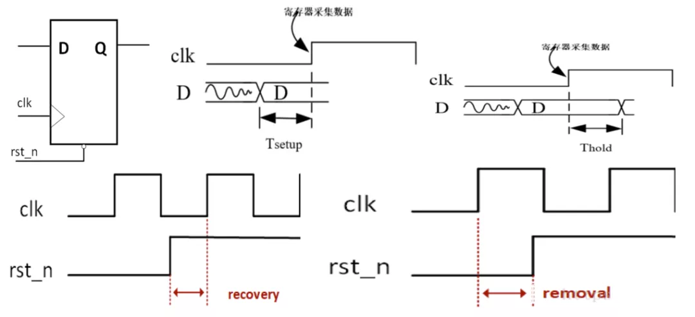

#### 时序分析有哪些类型

时序分析包括静态时序分析（STA）和动态时序分析。

* 动态时序分析：将布局布线生成的布线延迟信息反标注到门级网表中进行仿真，检查是否存在时序违例。此时的仿真包括门延迟和布线延迟信息，能够较好反应芯片的实际工作情况。因为不可能产生完备的测试向量，覆盖门级网表中的每一条路径。因此在动态时序分析中，无法暴露一些路径上可能存在的时序问题。
* 静态时序分析：采用穷尽分析方法来提取出整个电路存在的所有时序路径，计算信号在这些路径上的传播延时，检查信号的建立和保持时间是否满足时序要求，通过对最大路径延时和最小路径延时的分析，找出违背时序约束的错误。它不需要输入向量就能穷尽所有的路径，且运行速度很快、占用内存较少，不仅可以对芯片设计进行全面的时序功能检查，而且还可利用时序分析的结果来优化设计，因此静态时序分析已经越来越多地被用到数字集成电路设计的验证中。

#### 时序分析使用的工具有哪些

* 静态时序分析使用的工具
  * Xilinx Vivado Integrated Design Environment Time Engine
  * Altera Quartus II Timequest
  * DC等
* 动态时序分析使用的工具
  * Mentor Modelsim
  * Cadence NC-Verilog
  * Sysnopsys VCS

#### 静态时序分析之前的准备工作

撰写基本的时序约束文件，告知时序引擎一些必要的信息（比如时钟，输入输出延时等）。若没有正确的时序约束，那么时序分析的结果是没有意义的。

D触发器中Tsetup, Thold, Tco的由来

    

    图1.2 D触发器原理图

    

    图1.3 Th的由来

#### 序分析中的常用术语

* 源时钟（Source Clock/Launch Clock，也称发起时钟）
* 目的时钟（Destination Clock/ Capture Clock, 也称捕获时钟）
* 发起沿（Launch Edge，源时钟产生数据的有效时钟沿）
* 捕获沿（Capture Edge，目的时钟捕获数据的有效时钟沿）

发起沿通常在0ns，捕获沿通常在下一个发起沿，发起沿和捕获沿通常相差一个时钟周期。

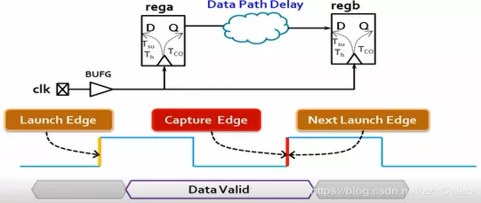

#### 一条普通时序路径的三要素

* 源时钟路径：从源时钟的源节点（通常是FPGA的时钟输入引脚）到源寄存器的时钟端口的路径。当时序路径的起点是FPGA输入端口时，该时序路径是没有源时钟路径的。
* 数据路径：从时序路径的起点到时序路径的终点之间的数据传播路径。时序路径的起点可以是源寄存器的时钟端口或FPGA的输入端口，时序路径的终点可以是目的寄存器的输入端口或FPGA的输出端口。
* 目的时钟路径：从目的时钟的源节点（通常是FPGA的时钟输入引脚）到目的寄存器的时钟端口的路径。当时序路径的终点是FPGA的输出端口时，该时序路径是没有目的时钟路径的。

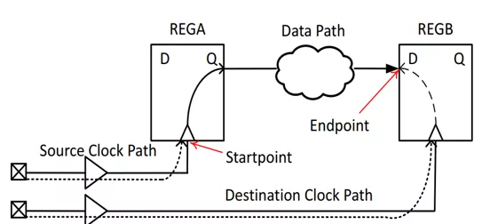

#### FPGA中常见的四种时序路径

1. 从FPGA的输入端口到目的寄存器的数据输入端口

   * 数据由Board Clock发起并在FPGA外部产生
   * 数据经过Input Delay的延迟后到达FPGA的输入端口
   * 数据经过FPGA的Internal Delay后到达由目的时钟驱动的目的寄存器

   这种路径是没有源时钟路径的，用户需要约束Input Delay和时钟来告知时序引擎必要信息，时序引擎才能正确的分析这种路径

2. 从源寄存器的时钟端口到目的寄存器的数据输入端口

   * 数据由源时钟发起并在FPGA内部产生
   * 数据经过Data Path Delay后到达由目的时钟驱动的目的寄存器

   这种时序路径是最常见的，用户需要约束源时钟和目的时钟告知时序引擎必要的信息，时序引擎才能正确的分析这种时序路径。

3. 从源寄存器的时钟端口到FPGA的输出端口

   * 数据有源时钟发起并在FPGA内部产生
   * 数据经过Internal Delay后到达输出端口
   * 数据经过Output Delay后被Board Clock捕获到

   这种路径是没有目的时钟路径的，用户需要约束Output Delay和时钟来告知时序引擎必要信息，时序引擎才能正确的分析这种路径。

4. 从FPGA的输入端口到FPGA的输出端口

   * 数据横穿FPGA，没有经过任何触发器，这种路径也叫in-to-out path，约束输入和输出延时的参考时钟可以使用虚拟时钟

   这种路径中只有数据路径，用户需要约束Input Delay和Output Delay，告知时序引擎必要的信息，时序引擎才能正确的分析这种时序路径。

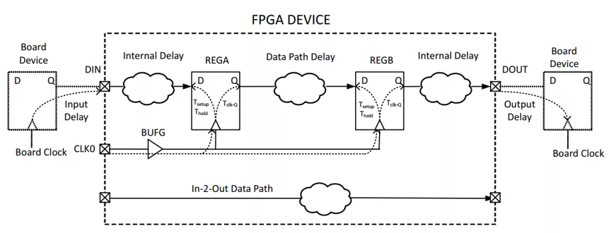

## 时序检查

### Setup 检查

#### 时序引擎如何进行Setup检查

1. 确定建立时间要求（建立时间的捕获沿-建立时间的发起沿）

   确定建立时间的捕获沿和建立时间的发起沿。

   时序引擎会找出发起时钟和捕获时钟的最小公共周期，然后在最小公共周期内找到所有发起时钟沿和捕获时钟沿的所有可能情况，并在所有可能的情况中挑选出**最小的建立时间需求**（大于0），从而确定Launch Edge和 Capture Edge。

   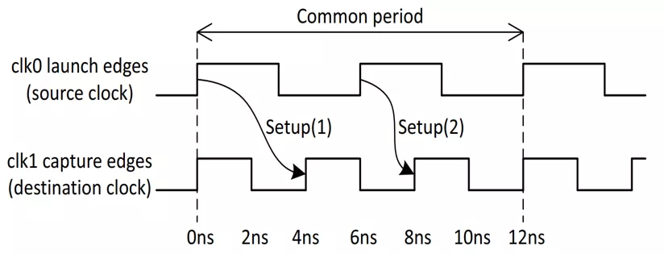

   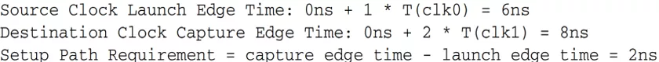

2. 计算数据的需求时间

   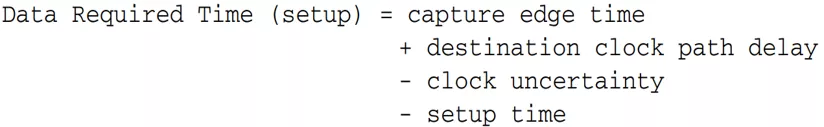

3. 计算数据的到达时间

   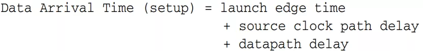

4. 计算Setup的裕量（Slack）

   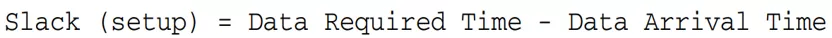

#### Setup分析实例

* Data Arrival Time = Launch Edge + Tclka + Tco + Tdata(Tlogic + Tnet)

  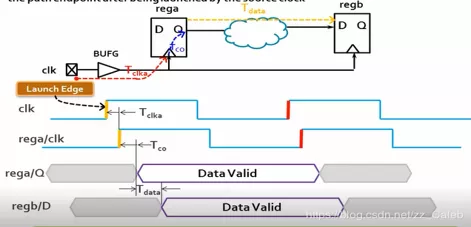

* Data Require Time = Capture Edge + Tclkb - Tsu

  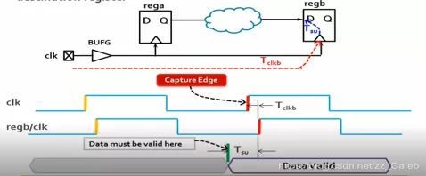

* Setup Slack = Data Require Time - Data Arrival Time

  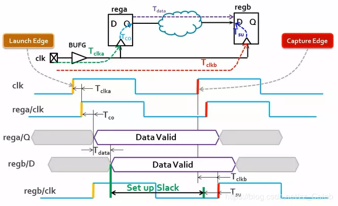

#### Setup Slack为负的因素

* Setup Slack = (Capture  Edge - Launch Edge) + (Destination clk delay - source clk delay) - Setup Time - Clk uncertainty - datapath delay
* Setup Slack = Setup Requirement (一定大于0) + clk skew - Tsu - Tclk uncertainty - Tlogic - Tnet - Tco

1. Setup Requirement与实际情况不符

   建立时间需求过小，这种情况通常会在同步跨时钟域路径中出现，在同步跨时钟域路径中的源时钟频率与目的时钟频率的相位关系虽然是已知的，但是时序引擎默认选择的捕获沿通常都是错误的，需要用户通过多周期路径约束的方式手动修正建立时间需求。比如下图中，两个同频不同相的同步时钟，时序引擎默认选择的捕获沿是目的时钟第二个上升沿，导致建立时间需求非常小，最终肯定会导致时序违例。

   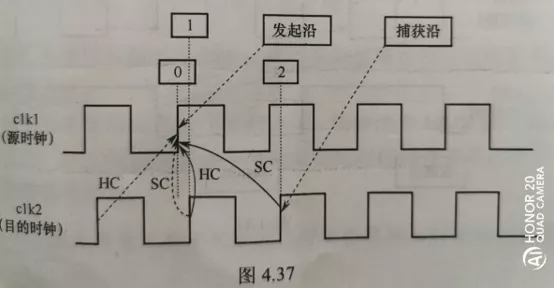

2. Clk Skew为负值，且很大

   通常情况下，同一个时钟下的时钟歪斜不应该超过300ps，同步跨时钟域路径的时钟歪斜不应该超过500ps，异步跨时钟域路径的时钟歪斜一般比较大，因为它们的时钟源不同。

   当出现时钟歪斜大的情况时:

   * 检查源时钟路径和目的时钟路径上是否干净，时钟路径上是否引入了组合逻辑，时钟路径是否使用了过多的BUFGCE，时钟路径上是否级联了多个BUFGCE导致时钟延时变大。
   * 检查源时钟路径和目的时钟路径所经过的模块是否相同，比如源时钟路径上经过全局缓冲，PMMCM，但是目的时钟路径上只经过了全局缓冲。如下图所示，第一条路径的源时钟路径上有BUFGCE/MMCM/BUFGCE，而目的时钟路径上只有BUFGCE，所以源时钟路径和目的时钟路径的延时不同，导致时钟歪斜较大，应该尽量避免此类路径。第二条路径的源时钟和目的时钟都是来源于MMCM的不同的时钟，所以时钟歪斜较小。

   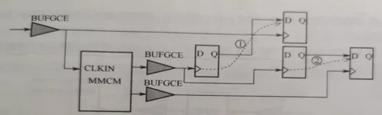

3. Tsu/Tco很大

   当设计中使用Block（DSP/Block RAM等）时，应该要注意以下问题。对于以这些Block为时序路径的起点或终点的时序路径，这些**Block的Tsu/Th/Tco都比普通的寄存器大**，而且这些Block的布线延时和时钟歪斜比较大。所以当使用这些Block作为时序路径的终点时，它的起点一定要是触发器，比如说一个Block RAM的写数据信号，输入进Block前最好打一拍。当使用这些Block作为时序路径的起点时，应该使用Block 内部的输出寄存器，比如使用由Block RAM组成的FIFO时，尽量不要使用首字置出的，而使用打一拍后输出的，使用后者可以显著降低Tco。当时序路径为从一个Block到另一个Block时，中间需要进行打拍操作。当使用这些Block的控制端口时，应该保证这些控制信号的低扇出，如使用由Block RAM组成的FIFO时，应该尽量降低读/写能信/地址信号的扇出。

   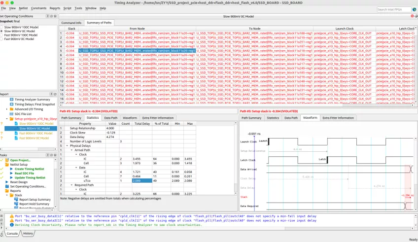

4. Tlogic大

   一般情况下，逻辑延时与时序路径的逻辑层级数息息相关，逻辑层级是指时序路径的起点和终点之间组合逻辑单元（LUT）的个数，而逻辑层级多一级意味着多1个LUT的延时加1条连接LUT的网线延时。通常一级逻辑层级的延时标准是1个LUT加1根网线的总延迟为0.5ns，如果某条路径的逻辑级数大于时钟周期/0.5ns，那么这条路径就被称为长路径。

   常用的处理长路径的方案有两种：

   * 修改rtl代码，在长路径的逻辑中插入流水线，将长路径打破分为多条短路径；
   * 使用综合工具的retiming优化方式，retiming实际上是寄存器重定向，原理是当某条长路径的相邻路径的建立时间裕量较大，那么它可以调整中间寄存器的位置，来调整布线延迟，通过适当增加相邻路径的布线延迟而减少长路径的布线延迟，使得那些时序违例较小的长路径通过这种微调实现时序收敛。需要强调的是，**这种方式优化的力度非常有限**，它只适合时序违例较小的长路径，对于一些延时特别大的长路径而言，也是无力回天。

   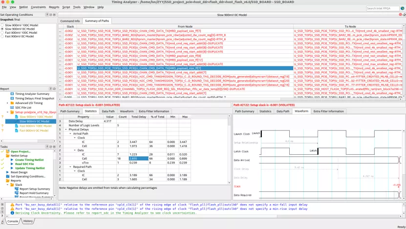

5. Tnet大

   一般情况下，布线延迟与设计整体或局部模块的资源利用率以及拥塞程度息息相关。

   在正常情况下，一条网线的延时小于1ns，在发生拥塞的区域，网线的延时可能达到若干ns，导致布线延时显著增加。为了解决布线延迟大，需要从降低资源利用率和降低拥塞程度下手，比如某个模块使用了大量的寄存器堆，占用了大量的资源，此时应该考虑使用Block RAM代替这些寄存器堆；某个模块使用了大量的数据选择器，此时应该考虑如何优化这些数据选择器；某个模块的控制信号扇出比较大，与其他模块的互联很重，此时应该考虑如何降低这些信号的扇出；某条时序路径的起点或终点是Block，由于Block的位置比较固定，所以Block的布线延迟会大一些。最后需要强调的是，一定要额外关注高扇出的网线也会对布线延时产生影响。

   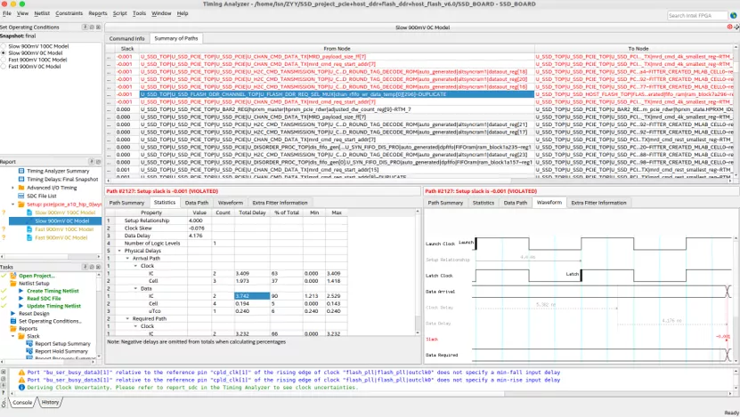

   TimeQuest时序分析（Setup）
   
   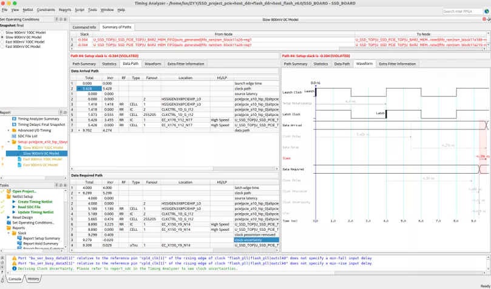

### Holdup 检查

#### 时序引擎如何进行Holdup检查

1. 确定保持时间要求（确定发起时钟沿和捕获时钟沿）

   **保持时间要求是以建立时间要求为基础的**，保持时间要求有两种：

   * 当前建立时间的发起沿产生的数据不能被当前建立时间的捕获沿的前一个有效沿捕获

   * 当前建立时间的发起沿的下一个有效沿产生的数据不能被当前建立时间的捕获沿捕获

   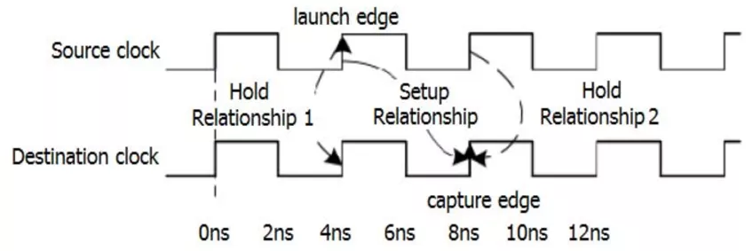

   根据所有的建立时间需求找到所有的保持时间需求，并从保持时间需求（可正可负）中找到最大的保持时间需求。!

   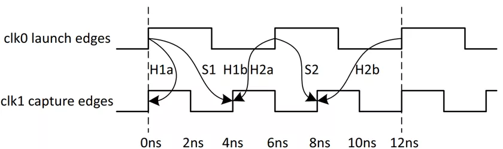
	

   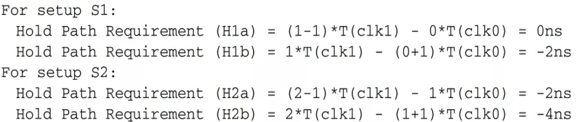

2. 计算数据的需求时间

   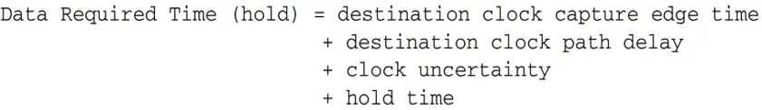

3. 计算数据的到达时间

   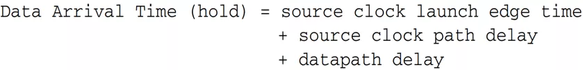

4. 计算Hold up的裕量(Slack)

   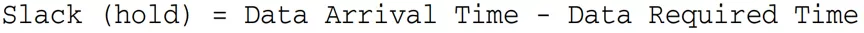

#### Holdup分析实例

* Data Arrival Time (new data) = Launch Edge + Tclka + Tco + Tdata(Tlogic + Tnet)
* Data Require Time = Capture Edge + Tclkb + Th
* Hold up Slack = Data Arrival Time - Data Require Time

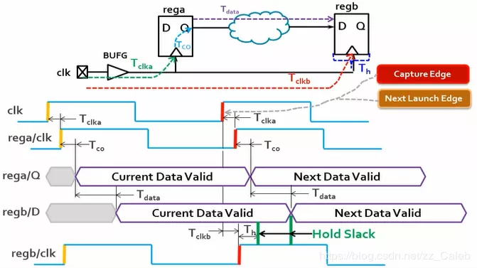

#### Holdup Slack为负的因素

* Holdup Slack = (Launch Edge - Capture Edge) + (Tclka - Tclkb) + Tco + Tdata(Tlogic + Tnet) - Th
* Holdup Slack = Tco + Tdata(Tlogic + Tnet) - Th - Holdup Requirement - Clk skew

Hold up Slack为负的情况比较少见，当Setup Slack有较大裕量时，通常工具会自动插入延时来增加Hold up Slack。

1. 保持时间需求大于0（通常由时序引擎选择错误的捕获沿导致）
2. 时钟歪斜大于300ps（通常由时钟路径上的组合逻辑导致）
3. Th过大（通常由时钟路径上的组合逻辑导致）

TimeQuest时序分析（Holdup）

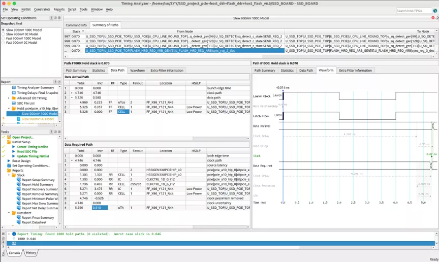

### Recovery 检查

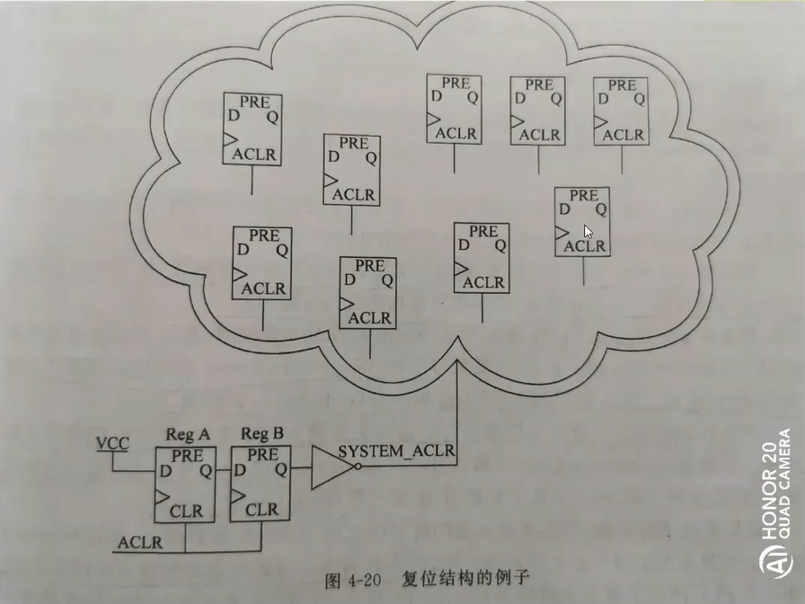

#### 时序引擎如何进行Recovery检查

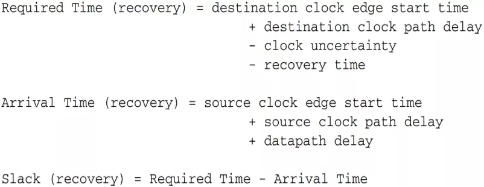

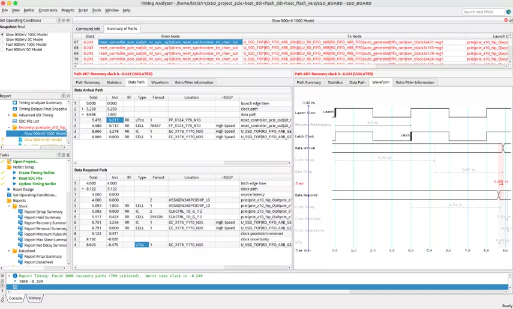

### Removal 检查

#### 时序引擎如何进行Removal检查

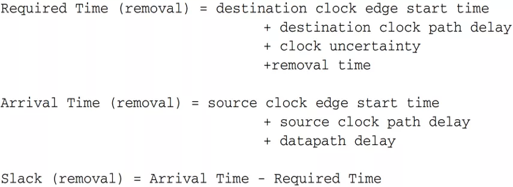

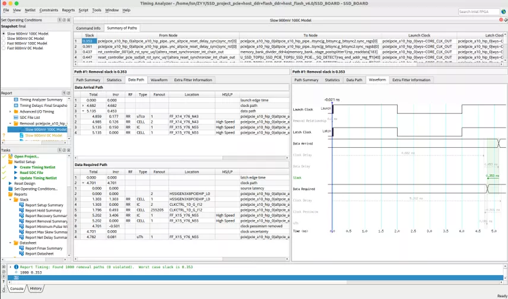

## 时序约束

时序引擎能够正确分析4钟时序路径的前提是，用户已经进行了正确的时序约束。时序约束本质上就是告知时序引擎一些进行时序分析所必要的信息，这些信息只能由用户主动告知，时序引擎对有些信息可以自动推断，但是推断得到的信息不一定正确。

* 第一种路径需要约束Input_delay

* 第二种路径需要约束时钟

* 第三种路径需要约束Output_delay

* 第四种路径需要约束Max_delay/Min_delay

  

### 时钟约束

#### 时序约束类型

首先用户必须要正确的约束时钟，时序引擎才能根据时钟信息进行各种时序检查。

用户约束时钟时，一般有两种类型的时钟需要约束。

* 主时钟（Primary Clock）

  主时钟（Primary Clock）有两种类型：第一种是从FPGA的全局时钟输入引脚输入的时钟；第二种是从高速收发器输出给用户的恢复时钟

* 生成时钟（Generated Clock）

  生成时钟（Generated Clock）有两种类型：第一种是由FPGA的专用时钟管理模块（PLL/MMCM）产生的时钟（这种时钟可以由时序引擎自动推断出来）；第二种是由用户通过LUT或寄存器产生的时钟（这种时钟必须由用户手动约束）

1. 主时钟（Primary Clock）约束

   使用`Create_clock`进行约束

   * 第一种是从FPGA的全局时钟输入引脚输入的时钟：

     全局时钟输入引脚是sysclk，时钟周期10ns，占空比50%，相移0度。

     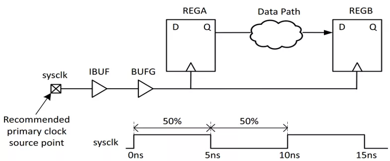

     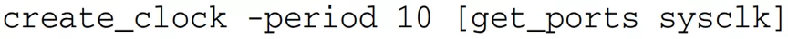

     全局时钟输入引脚是ClkIn，时钟周期10ns，占空比25%，相移90度

     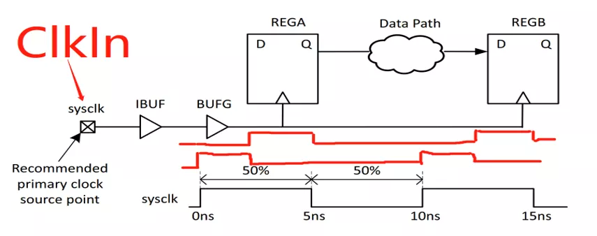

     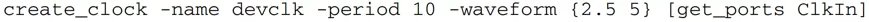

   * 第二种是从高速收发器输出给用户的恢复时钟 全局时钟输入引脚是sysclk，时钟周期3.3ns，占空比50%，相移0度

     

     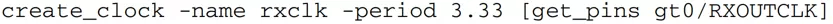

2. 生成时钟（Generated Clock）约束

   用`Create_generated_clock`进行时序约束

   每个生成时钟都会对应一个时钟源（Master_clk），这个时钟源可以是Primary Clock或者另一个Generated Clock。

   在约束生成时钟时，用户不需要描述生成时钟的周期和波形，只需要描述由Master_clk经过了怎样的变化而产生的生成时钟即可。比如经过分频（-devide_by），倍频（-multiply_by），反相（-invert），相移（-edge_shift）等等操作。

   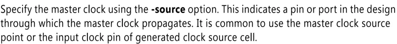

   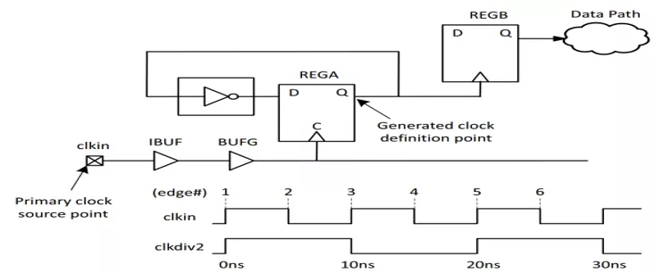

   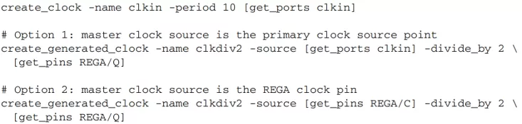

   当生成时钟需要进行相移时，使用-edge_shift选项。

   -edge_shift不能与-divide_by/-multiple_by/-invert同时使用。

   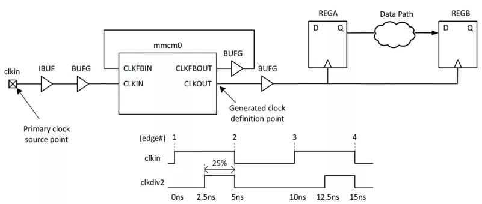

   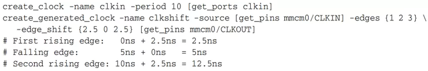

#### 时钟分组

时序引擎默认情况下会分析所有时钟之间的时序路径，用户可以通过时钟分组`set_clock_group`命令或伪路径`set_false_path`命令来关闭一部分路径的时序分析。

* 使用`set_clock_group`命令，时序引擎会将不同分组的时钟之间的路径分析关闭，相同分组的时钟之间的路径仍然存在。
* 使用`set_false_path`命令，时序引擎会忽略两个时钟的双向路径，被忽略的路径不一定能够正常工作，需要用户确保该路径使用了两级触发器同步或者按照异步数据传输方式传输数据。用户负责保证这些被忽略的路径可以正常工作。

**两个时钟的关系**

1. 同步时钟（synchronous clock）

   两个时钟之间的相对相位关系是固定的（两个时钟来源于同一个Primary Clock），并且这两个时钟的频率的最小公共周期是个整数。

   比如一个生成时钟（200M）和该生成时钟的Master_clk（100M）之间就属于同步时钟关系，因为这两个时钟的相位关系是确定的，并且可以找到两个时钟的最小公共周期。通常情况下，一个Primary Clock和它产生的生成时钟之间都属于同步时钟关系，除非找不到最小公共周期。**属于同步时钟关系的两个时钟之间的路径是可以进行时序分析的。**

2. 异步时钟（asynchronous clock）

   两个时钟之间的相对相位关系不确定。

   比如FPGA上两个晶振分别产生两个Primary clock（相对相位关系不固定），这两个Primary clock分别从FPGA的两个全局时钟引脚输入给两个MMCM，由两个MMCM分别产生的生成时钟之间属于异步时钟。一般情况下，不同的Primary clock之间都属于异步时钟，这些Primary clock分别产生的生成时钟之间也属于异步时钟关系。

   **属于异步时钟关系的两个时钟之间的路径无法进行正确的时序分析。**

   一般情况下，如果用户不通过时钟分组对时钟之间的关系进行约束，时序引擎会默认所有的时钟之间都属于同步时钟关系

3. 不可扩宽的时钟（unexpandable clock）

   对于这类时钟，时序引擎无法在1000个时钟周期内找到两个时钟的公共周期，时序引擎就会从这1000个时钟中找到建立时间需求最差的情况，并进行时序分析，然而它不一定是FPGA实际运行过程中建立时钟需求最差的情况，因为在1000个时钟周期外可能还会有建立时钟需求更差的情况，这样一来，时序引擎的分析结果就无法保证该路径一定不会出现问题，所以时序引擎的分析结果也就变的毫无意义。

   比如说由同一个Primary Clock驱动的两个MMCM的生成时钟分别是clk0（5.125ns）和clk1（6.666ns），虽然他们的相对相位关系是固定的，但是时序引擎无法保证对两个时钟之间的路径的分析属于最差情况，这种情况和异步时钟之间的时序分析类似，时序分析的结果都看起来正常，但是这个结果是不可信的。所以对这种时钟的处理方式与处理异步时钟是相同的，用户都需要进行跨时钟域的操作。

**总结：异步时钟和不可扩展的时钟之间的路径都无法进行正确的时序分析，所以在时序分析之前，需要使用`set_clock_group`对时钟进行分组，从而将这些无法进行正确时序分析的路径忽略掉。**

**时钟分组实例**

* 第一个Primary clock clk0从FPGA的全局时钟引脚进入了一个MMCM，MMCM生成了两个生成时钟 userclk, itfclk

* 第二个Primary clock clk1是一个高速收发器输出的恢复时钟，将该恢复时钟输入进一个MMCM，MMCM生成了两个生成时钟gtxclk, gtxclktx

  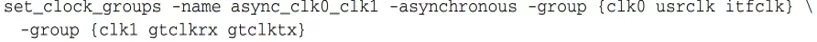

  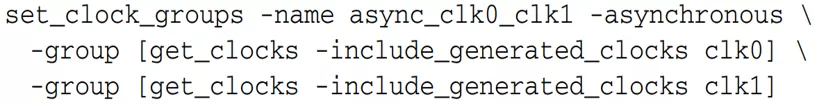

时序约束后时序引擎如何进行第二种路径的时序分析？

  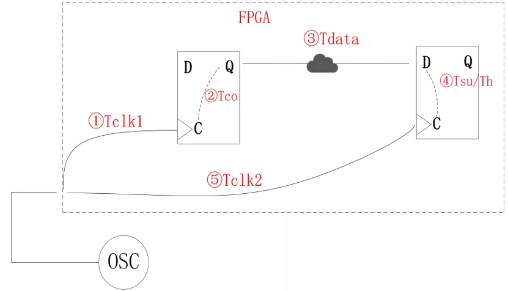

  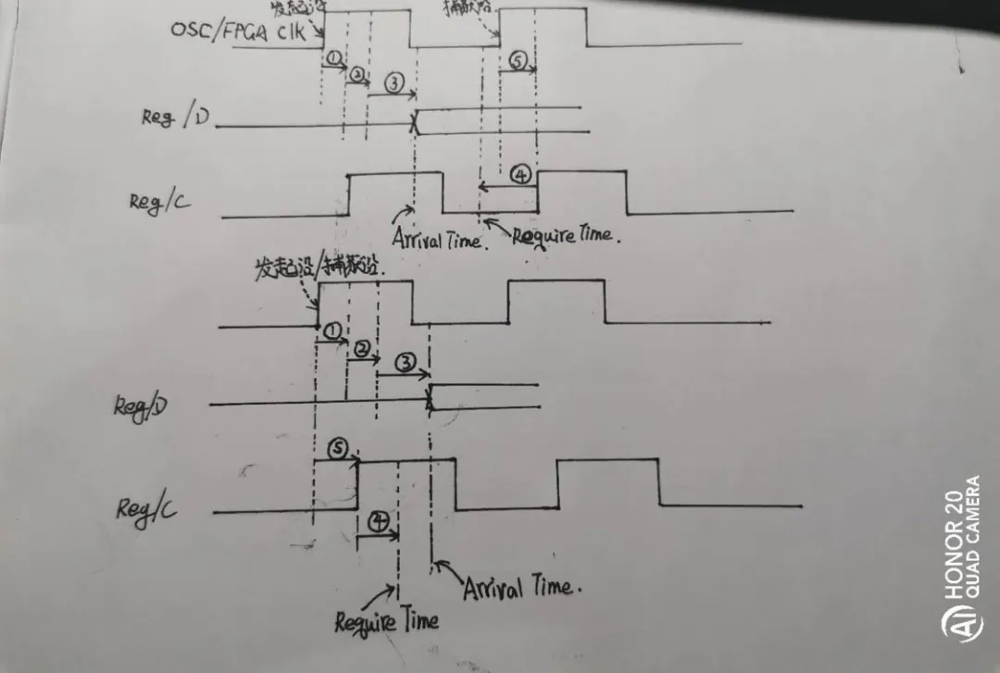

### Input/Output 延时约束

#### 什么是Input delay? 如何计算它？如何约束它？

**Input delay概念**

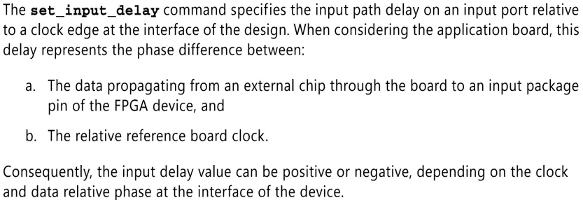

**Input delay计算**

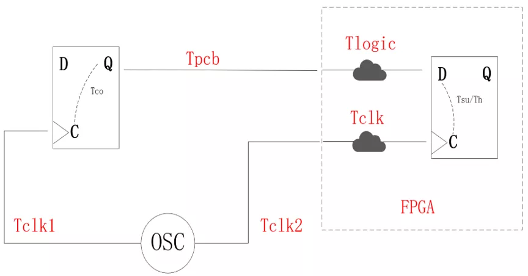

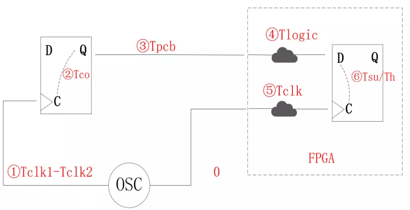

**Max Input Delay = Tco(Max) + Tpcb(Max) - Clk skew(Min)**

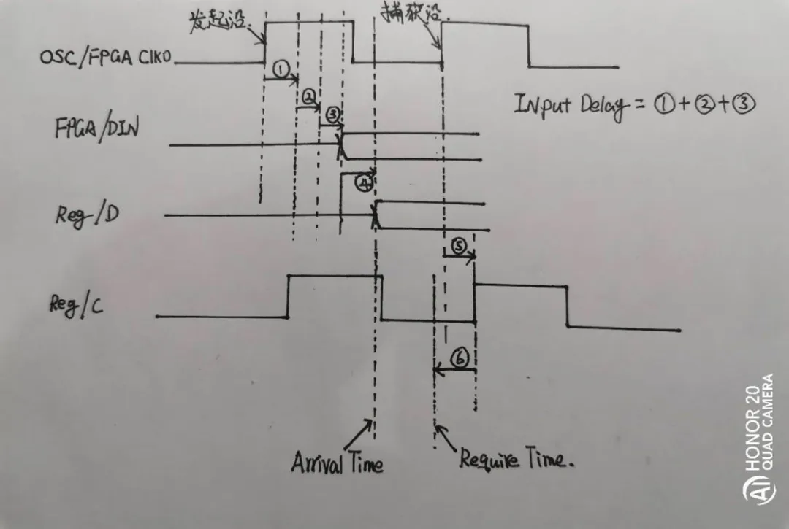

**Min Input Delay = Tco(Min) + Tpcb(Min) - Clk skew(Max)**

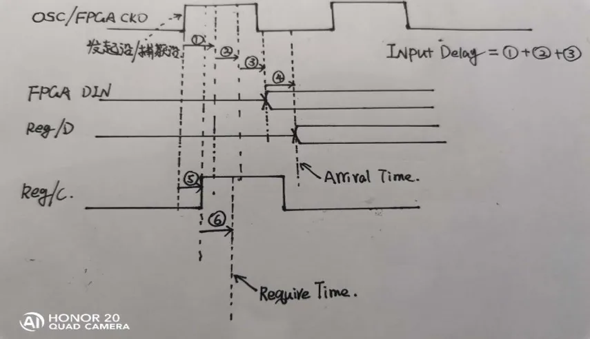

**Input delay约束**


#### 什么是Output delay？如何计算它？如何约束它？

**Output delay概念**


**Output delay计算**


**Max Output Delay = Tpcb(Max) + Tsu - Clk skew(Min)**


**Min Output Delay = Tpcb(Min) - Th - Clk skew(Max)**


**Output delay约束**


### Multicycle 约束

#### 为什么要进行Multicycle约束？

* 时序引擎默认情况下会在建立时间需求/保持时间需求最差的情况下进行时序分析，而时序引擎选择的这种需求不一定是用户真正希望的，而且时序引擎默认选择的这种需求是非常严苛的，甚至是根本无法满足的。此时就需要用户进行Multicycle约束，手动修改建立时间需求/保持时间需求。
* 用户希望放松某些路径的约束力度，就可以通过Multicycle约束调整建立时间需求/保持时间需求。 

使用`set_multicycle_path`命令进行约束


#### 如何进行正确Multicycle约束？

注：使用`set_multicycle_path`命令

1. 在源时钟和目的时钟相同的情况下进行Multicycle约束

   

   

   * 每两个时钟发起一次数据，每两个时钟捕获一次数据

     

     

     

     

     

   * 每四个时钟发起一次数据，每四个时钟捕获一次数据

     

   * 只调整setup需求，Holdup需求会发生相应的变化，但是变化结果是错误的

     

     

   * 进一步调整Holdup需求（-start）

     

     

   * Set_multicycle_path 4 –hold –end –from [get_pins data0_reg/C] – to [get_pins data1_reg/C]

     

2. 在源时钟和目的时钟频率相同且有正向偏移的情况下（正向偏移0.3ns）

   

   

   先调整setup需求，holdup需求发生相应的变化，但变化的结果是正确的

   

   

3. 在源时钟的目的时钟频率相同且有负向偏移的情况下（负向偏移0.3ns）发生负向偏移时，通常不需要进行Multicycle的约束，除非负向偏移过大

   

   

4. 在源时钟和目的时钟频率不同的情况下（源时钟慢，目的时钟快）

   

   

   调整setup需求（只能用-end，不能用-start），Holdup需求发生相应的变化，变化的结果是错误的。

   

   

   进一步调整Holdup需求（只能用-end，不能用-start）

   

   

5. 在源时钟和目的时钟频率不同的情况下（源时钟快，目的时钟慢）

   

   

   同时调整setup需求（只能用-start，不能用-end）和Holdup需求（只能用-start，不能用-end）

   

   

### Falsepath 约束

#### 什么样的路径属于FalsePath?

注：使用`set_false_path`命令

FalsePath路径是指该路径在拓扑结构中的确存在，但是满足以下任一条件的路径：

* 在实际运行过程中，该路径不工作
* 该路径不需要进行时序分析

比如：已经做了两级触发器同步的跨时钟域路径

只在上电时工作一次的寄存器

异步复位路径或用于测试的路径

**注意**：如果用户的目的只是放松某条路径的时序约束，可以用`set_multicycle_path`命令进行约束，不要使用`set_false_path`

**设置FalsePath的好处**

1. 减小综合、实现、时序分析的时间
2. 极大的提升工具对设计的综合、实现、优化的结果


-from/-to的node_list必须是有效的时序路径的起点和终点，或是时钟。-through的node_list可以是ports/pins。

#### FalsePath约束举例

1. 将异步复位信号设置为伪路径

   

2. 将CLKA到CLKB的单向路径设置为伪路径

   

3. 将CLKA到CLKB以及CLKB到CLKA的双向路径设置为伪路径

   

**注**：当有多个异步时钟之间的路径需要设置为伪路径时，推荐使用`set_clock_group`命令。


凡是经过MUX1/a0，到MUX2/a1的时序路径都会被忽略，采用-through的好处是不需要具体指定时序路径的起点和终点，-through的顺序需要注意，上述命令描述的是先经过MUX1/a0，然后再经过MUX2/a1。

### Maxdelay约束

#### 什么情况下使用Maxdelay约束？

1. 它可以代替Multicycle约束，调整建立时间需求，而且`set_max_delay`约束的优先级比Multicycle约束要高
2. 对于两个异步时钟域之间的异步信号不需要进行时序分析，但是用户对路径延迟有一定的要求时，可以使用`set_max_delay -datapath only`进行约束。`-datapath only`用于忽略时钟歪斜，只考虑数据路径的延时。

**注**：当用户需要对两个异步时钟域之间的部分/所有路径指定路径的最大延时，用户需要使用`set_max_delay -datapath only`对这些路径的延时进行约束，同时用户不能使用`set_clock_group`约束，因为`set_clock_group`的优先级比`set_maxdelay`高。**两个时钟域之间的剩余路径可以使用`set_false_path`进行约束。**

对于通过set_false_path/set_clock_group命令进行约束的路径，综合器不会对该路径进行优化，很可能导致两个寄存器的位置很远。

1. 单bit信号跨时钟域（两级触发器同步）

   此时只需要使用`set_false_path/set_clock_group`对异步信号的路径约束即可，因为此时两个寄存器之间的延迟不会影响功能，只会影响性能，此时不需要使用Maxdelay约束。

   

2. 多bit信号跨时钟域（格雷码）

   此时若只使用`set_false_path/set_clock_group`对异步信号的路径约束，可能会影响格雷码功能的正确性。所以需要Maxdelay对数据路径的延迟进行约束。

   设计中也常用一种带有格雷码控制的FIFO来实现异步时钟域的隔离。计数器和读写指针等需要用BRAM外部的逻辑搭建，这样的结构就不能简单约束`set_clock_groups`，还要考虑这些外部逻辑如何约束。

   在存储器外部有一些用FPGA逻辑搭建的写指针和读指针控制，分属不同的时钟域，存在跨时钟域的时序路径。

   此时如果仅将读写时钟用`set_clock_goups`约束为异步时钟，想当于设置从A到B和从B到A的路径全部为false path。false path的优先级最高，很显然这么做会导致所有跨读写时钟域的路径全部不做时序分析，读写指针和相关控制逻辑也就失去了存在的意义。

#### 如何进行Maxdelay约束

`set_max_delay -from [get_cells GCB0[*]] -to [get_cells GCB1a[*]] -datapath_only 5`（具体延迟大小一般不超过目的时钟的时钟周期）

`set_false_path -from [get_cells rega] -to [get_cells regb]`


