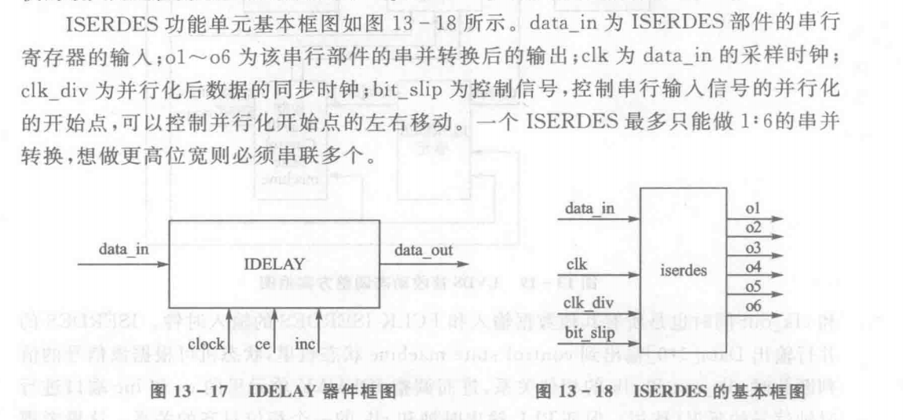

40GSPS采样率，一共八片5GSa/s的ADC交替采样。1000个点的采样时间为： 

$$
T_{acq}=1000 \times 1/40GSPS=1000 \times 25ps=25ns
$$

采集板将1000个点传输到处理板，DDR方式传输，8片ADC，传输所需时间：  

$$
T_{acq\_to\_pro}=1000/8/2\times3.2ns=200ns
$$

十路并行映射100个点，数据映射时间 $T_{dpo}$  

$$
T_{dpo}=100\times3.2ns=320ns
$$

三维数据库经过刷新间隔为20ms的波形叠加，传输到上位机所需时间：  

$$
T_{trans}=1000 \times 200 \times 3.2ns=640000ns
$$

工控机每20ms刷新一次，则这段时间内采集到的波形幅数N为：  

$$
T=20ms-T_{trans}=19360us
$$

$$
N=\frac{T}{T_dpo}=\frac{19360us}{320ns}=60500
$$

最高捕获率为：  

$$
R_{dpo}=\frac{N}{20ms}=3025000
$$

